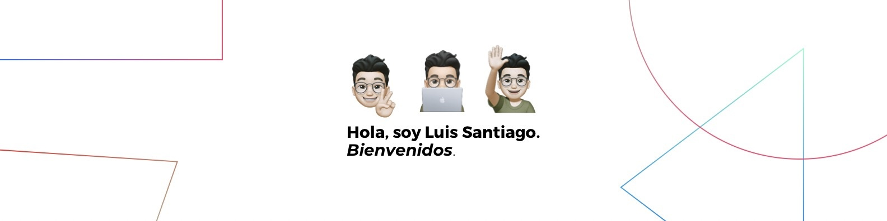

 

  <samp>
    Hola, soy Santiago👋  
    🔥 Desarrollador de software  
    :sparkles: Herramientas de desarrollo: JavaScript, React, Django, Python, Typescript ...  
    <a href="mailto:lsantibz@gmail.com">Email: lsantibz@gmail.com</a> 
    :art: Portfolio: En construccion  
                Linkedin: https://twitter.com/saadpastadev?lang=en 
  :briefcase: Instagram: aca doubleU -> link  

  </samp>

